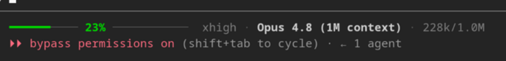

# AI-agent setup instructions — Claude Code status line (context-window usage bar + model, effort & tokens)

**Just paste this repo's link into your favorite AI coding agent (Claude Code, Cursor, Codex…) and it sets up the status
line for you** — it copies the script into `~/.claude/` and wires it into `settings.json`. Or run the one-command
installer below. A clean, dependency-light `statusLine` for [Claude Code](https://claude.com/claude-code).


[](https://vibecodeblogger-public.github.io/ai-agent-setup-instructions-claude-code-statusline-context-window-usage-bar-model-tokens-bash/)

🌐 **New here? Start on the [landing page →](https://vibecodeblogger-public.github.io/ai-agent-setup-instructions-claude-code-statusline-context-window-usage-bar-model-tokens-bash/)** — an illustrated overview, including the colour scheme.

<p align="center">
  
</p>

## What it shows

One line, left → right:

```
━━━━━━━━━ 34% ━━━━━━━━──────────   ·  high · Claude Opus 4.8 · 68k/200k
└──── context-window bar, % centered ────┘    effort   model        tokens
```

- **A thin context-window usage bar** (`━`/`─`) that fills left→right with how much of the context window is used, with the
  **percentage written in the center** of the bar — so the bar never changes length.
- **Color by fill:** 🔵 blue `0–20%` · 🟢 green `21–90%` · 🟡 yellow `91–95%` · 🔴 red `96–100%` — you *feel* the context
  filling up at a glance and know when a `/compact` is coming.
- **effort** (reasoning level — hidden when the model has none) · **model** name · **tokens** used / window size (`68k/200k`).

Degrades gracefully: `used_percentage` is `null` right after start or `/compact` → shown as `0%`. Runs **without** `set -e`,
so a hiccup never blanks your status line.

## What the colors mean

The bar isn't only *how full* the context is — each color is a **prompt to act**. Here is *why* each one exists and what to
do when you see it:

- 🔵 **Blue — `0–20%` — the context was probably just refreshed.**
  A near-empty window means either a fresh session **or a `/compact` that just ran** inside Claude Code. After a compact, the
  earlier conversation is summarized — so anything you told *this specific agent* before, its **role / persona** or your
  **project's code-writing rules**, may have been dropped and forgotten. Blue is your cue to **remind this agent of its role
  and re-state the project's coding rules**, so it doesn't drift.
- 🟢 **Green — `21–90%` — all good.**
  Healthy working range. The agent has plenty of room; just keep going.
- 🟡 **Yellow — `91–95%` — pay attention.**
  The window is filling up. This is the moment to ask: *can the AI realistically finish the current task before it runs out of
  room?* If that's doubtful, it is often better to **stop it now, have it write a technical spec (the remaining work) to a
  file**, and then continue **after a `/compact`** — rather than let it get cut off mid-task.
- 🔴 **Red — `96–100%` — the same signal as yellow, but urgent.**
  Same decision as yellow, only the risk of a mid-task cutoff or degraded output is now high — it pulls your eye on purpose.
  Capture the plan / spec to a file and compact **now**.

> **🤖 Dear AI agent setting this up:** once you have installed the status line, **print a short message to the user** that
> explains this color scheme — what each color signals and *why blue exists* (the post-`/compact` "re-state your role and the
> project's coding rules" reminder) — so they know how to read the bar from the very first session.

## Install

### Option A — let your AI do it
Paste this repo's URL into Claude Code (or your agent) and say *"install this status line."* It copies `statusline.sh` into
`~/.claude/` and adds the `statusLine` block to `~/.claude/settings.json`.

### Option B — one command
```sh
git clone https://github.com/VibeCodeBlogger-Public/ai-agent-setup-instructions-claude-code-statusline-context-window-usage-bar-model-tokens-bash.git
cd ai-agent-setup-instructions-claude-code-statusline-context-window-usage-bar-model-tokens-bash
./install.sh
```

### Option C — manual
1. Copy `statusline.sh` to `~/.claude/statusline.sh`, then `chmod +x ~/.claude/statusline.sh`.
2. Add this to `~/.claude/settings.json`:
   ```json
   "statusLine": { "type": "command", "command": "~/.claude/statusline.sh" }
   ```
3. Restart Claude Code / start a new session.

## Customize

Open `~/.claude/statusline.sh`:

- **`WIDTH=26`** — the bar length in characters (make it thinner or wider).
- **Colors & thresholds** — the ANSI 256-color codes (`38;5;<n>`) and the `-le 20 / 90 / 95` cutoffs.
- **Right tail** — reorder or drop `effort · model · tokens` at the bottom of the script.

## Requirements

`bash`, [`jq`](https://jqlang.github.io/jq/) (parses the session JSON Claude Code pipes in) and `awk` (humanizes token
counts) — all standard on Linux and macOS.

## How it works

Claude Code pipes a JSON blob about the current session into the `statusLine` command on **stdin**. The script reads
`.model.display_name`, `.effort.level`, `.context_window.used_percentage`, `.context_window.context_window_size` and
`.context_window.total_input_tokens`, then renders the centered bar plus the right-hand tail and prints a single line.

## License

MIT — see [LICENSE](LICENSE). © 2026 VibeCodeBlogger.
